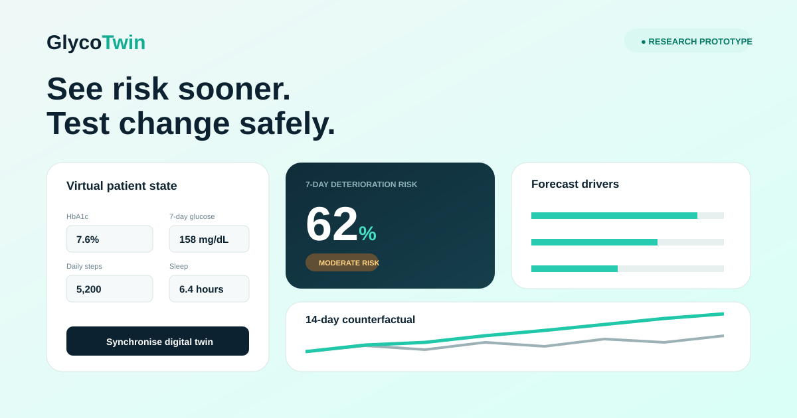
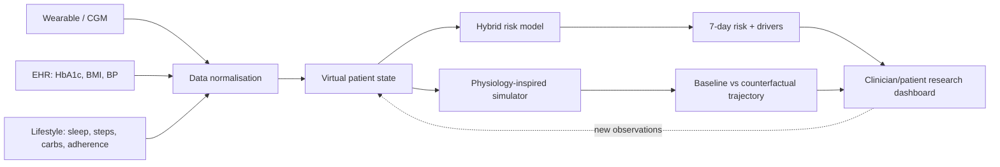

# GlycoTwin

**An explainable Type 2 Diabetes Digital Twin that forecasts seven-day glycaemic deterioration and simulates lifestyle counterfactuals.**

> Built for the [Happiest Health Digital Twin Challenge 2026](https://unstop.com/hackathons/crp-digital-twin-challenge-2026-happiest-health-1757873). This is a research proof of concept using synthetic data—not a medical device or clinical decision-support system.

## The problem

India carries a major Type 2 Diabetes burden, while fragmented EHR, wearable, and lifestyle signals are often reviewed only after deterioration. GlycoTwin turns those signals into a continuously updated virtual patient state. It answers two focused questions:

1. **Forecast:** Is this patient at risk of sustained mean glucose above 180 mg/dL in the next seven days?
2. **Simulate:** How might the trajectory change under adjustments to activity, sleep, carbohydrate intake, and medication adherence?

## What makes this a Digital Twin—not just a dashboard

- **Stateful virtual patient:** a structured representation spanning EHR, CGM/wearable, and lifestyle features.
- **Continuous synchronisation:** `/api/v1/stream` assimilates new glucose readings into the twin.
- **Hybrid forecasting:** an ML model is blended with physiology-inspired constraints to reduce implausible extrapolation.
- **Counterfactual simulation:** compares baseline and intervention trajectories over 1–30 days.
- **Explainability:** surfaces directional forecast drivers in plain language.
- **Safety by design:** bounded inputs, explicit assumptions, synthetic-only development, and no prescriptive output.

## Demo



The browser dashboard includes a live risk forecast, ranked drivers, and an interactive 14-day scenario simulator.

## Architecture



See [`docs/ARCHITECTURE.md`](docs/ARCHITECTURE.md) for design decisions and production evolution.

## Quick start

### Local Python

```bash
git clone https://github.com/Sagnik1091/glycotwin.git
cd glycotwin
python -m venv .venv
source .venv/bin/activate             # Windows: .venv\Scripts\activate
pip install -e ".[dev]"
python scripts/train.py
uvicorn app.main:app --reload
```

Open **http://localhost:8000**. Interactive API docs are at **http://localhost:8000/docs**.

### Docker

```bash
docker build -t glycotwin .
docker run --rm -p 8000:8000 glycotwin
```

## API

### Forecast risk

```bash
curl -X POST http://localhost:8000/api/v1/risk \
  -H 'Content-Type: application/json' \
  -d '{"hba1c":8.2,"avg_glucose_7d":174,"steps_day":3500,"sleep_hours":5.8}'
```

### Simulate an intervention

```bash
curl -X POST http://localhost:8000/api/v1/simulate \
  -H 'Content-Type: application/json' \
  -d '{"patient":{"hba1c":8.2,"avg_glucose_7d":174},"intervention":{"steps_delta":3000,"sleep_delta":1,"carbs_delta":-50,"adherence_delta":0.1},"days":14}'
```

### Synchronise CGM-like readings

```bash
curl -X POST http://localhost:8000/api/v1/stream \
  -H 'Content-Type: application/json' \
  -d '{"patient":{},"glucose_readings":[152,168,181,173,160]}'
```

## Model and evaluation

The checked-in model is trained on a **reproducible synthetic cohort** (`scripts/train.py`). Synthetic labels represent seven-day deterioration to sustained mean glucose above 180 mg/dL. This demonstrates the pipeline without exposing personal health data.

Metrics are generated on a held-out 25% split and stored in `artifacts/metrics.json`. They validate implementation, not clinical performance. See:

- [`docs/MODEL_CARD.md`](docs/MODEL_CARD.md)
- [`docs/DATASHEET.md`](docs/DATASHEET.md)
- [`docs/VALIDATION.md`](docs/VALIDATION.md)

## Repository map

```text
app/                  FastAPI service and responsive web interface
twin/                 Patient state, risk model, simulator, explanations
scripts/train.py       Reproducible synthetic training pipeline
tests/                 Unit and API tests
docs/                  Architecture, model card, data sheet, validation, pitch
artifacts/             Trained model and held-out metrics
data/                   Example non-identifiable input
.github/workflows/     CI checks
```

## Tests

```bash
pytest -q
ruff check .
```

## Responsible-use boundaries

- Not for diagnosis, emergency detection, treatment selection, insulin dosing, or medication changes.
- All outputs are probabilistic research estimates and must not be presented as medical advice.
- No clinical validity is claimed; external and prospective validation is required.
- Input defaults and training records are synthetic and do not represent a real person.
- A production version requires consent, purpose limitation, encryption, audit logs, access controls, drift monitoring, subgroup validation, and clinician oversight.

## Roadmap

1. Retrospective validation on consented, de-identified Indian cohorts.
2. Calibrate for device, age, sex, geography, and care-setting subgroups.
3. Replace heuristic state assimilation with a temporal/state-space model.
4. Add FHIR R4 ingestion and vendor-neutral wearable adapters.
5. Run silent prospective validation before any clinician-facing pilot.
6. Conduct regulatory, security, privacy, and human-factors review.

## Team

Update `docs/SUBMISSION.md` with team name, university/incubator, member details, demo URL, and final GitHub URL before submission.

## License

MIT for software. Documentation and model outputs remain subject to the safety restrictions above.
