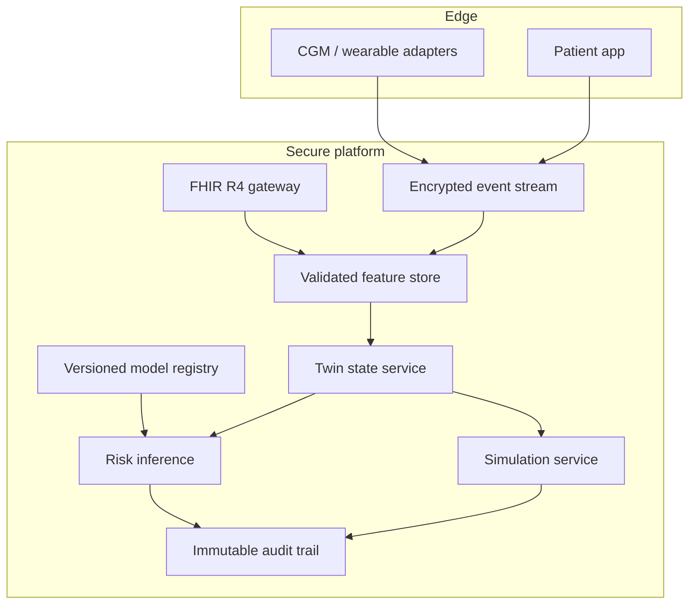

# Architecture and technical design

## Scope

GlycoTwin is deliberately narrow: Type 2 Diabetes and one localized outcome—**seven-day risk of sustained mean glucose above 180 mg/dL**. It does not attempt a whole-body model.

## Four layers

1. **Data:** EHR observations (HbA1c, BMI, fasting glucose, systolic BP), wearable/CGM summaries (seven-day glucose, variability, heart rate, steps, sleep), and self-reported lifestyle signals (carbohydrates and adherence).
2. **State:** `PatientState` is the canonical, validated snapshot. New glucose batches are assimilated with bounded exponential updating.
3. **Intelligence:** an auditable regularized logistic model learns risk; a transparent physiology-inspired score provides a guardrail. The displayed score is 65% ML and 35% guardrail.
4. **Interaction:** FastAPI exposes versioned endpoints; the responsive dashboard visualizes risk, drivers, and baseline/counterfactual trajectories.

## Why a hybrid model?

Pure black-box learning is risky when the demonstration cohort is synthetic. The hybrid blend keeps known directional relationships visible and gives a deterministic fallback when an artifact is absent. This does not create clinical validity; it makes the PoC more inspectable.

## Counterfactual engine

The simulator updates a latent average-glucose state toward a personalized target affected by changes in steps, sleep, carbohydrate load, and adherence. The coefficients encode plausible directionality, not treatment effects. Scenarios assume habits remain constant and no acute illness or medication change occurs.

## Production target architecture

## Non-functional requirements for a real pilot

- Encryption in transit/at rest; India-hosted deployment decision based on legal review.
- Explicit consent and revocation; data minimisation and retention controls.
- Role-based access, auditability, secrets management, and incident response.
- Idempotent event ingestion and source timestamps; missingness and device-quality flags.
- Model/version provenance on every inference.
- Monitoring for calibration, data drift, failure rates, and subgroup performance.
- Human review; alerts designed to avoid fatigue and automation bias.

## Deliberate exclusions

Insulin dosing, diagnosis, emergency alerts, medication recommendations, unvalidated individual treatment effects, and storage of identifiable health data are outside this PoC.
